# Grand Tours Analysis - 2025 Erdos Group Project

## Background and Project Overview:

The first objective of our project is to gather historic and training data of pro-athletes from [ProCyclingStats](https://www.procyclingstats.com) (PCS) and [Strava](https://www.strava.com) websites. Using the database created, we then train several models to predict the winner of a Stage of one of the three Grand Tours.

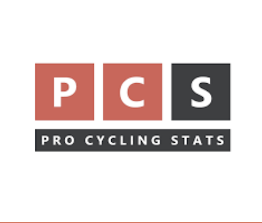 \


## Authors

- [Yonas Getachew](https://github.com/yonasG)
- [Neal Edgren](https://github.com/nedgren)
- [Deniz Olgu Devecioglu](https://github.com/heineborell)

## Stakeholders:

- Athletes and coaches who wish to compare their performance and predict their time.
- Sports performance companies.
- Betting websites.

## Key Performance Indicators

Root mean squared error (RMSE) and mean absolute percentage error (MAPE)

## Data

We scraped from PCS and Strava then stored in a SQLite database:

- **Grand tours data from PCS**: For a given tour and year and for each of the stages in that tour we have the name of participants, winner time and average speed, PCS profile score (to measure difficulty), vertical meters, and Startlist quality (to measure competitiveness), and how they stage was won (solo breakaway or sprint of a group).
- **Strava race-training data**: for a given activity-id and athlete-id we have name, vertical distance, and grade of a segment. We also have the time, speed, watt, and heart rate of the athlete.

- For detailed information about the database and scraping see [Appendix](#appendix) and scraping [repo](https://github.com/heineborell/tdf_results).

## EDA

A quick summary of the data contained in the grand_tours database is as follows

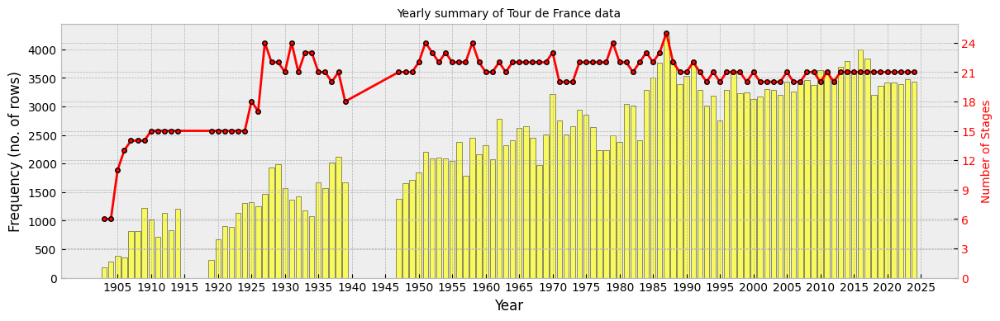 \
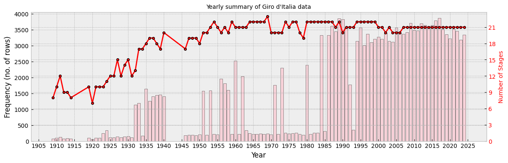\
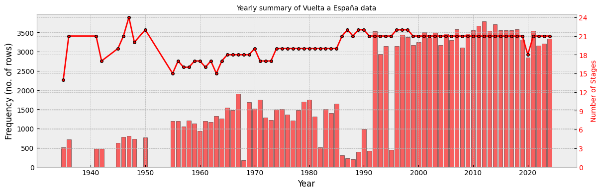

## Data Preprocessing

A small library of functions was built to clean and collate the data using [Pydantic](https://docs.pydantic.dev/latest/) to ensure consistency of data types.

## Modeling Approaches

- **Aggregate Model**: Combines race times for 2020-2023 in conjunction with aggregated athlete workout data, in order to predict race times for 2024.
- **Segment Model**: Uses segments from fast workout rides to try predicting race times, with a different model trained for each athlete.

## Results

- The aggregate model yielded best results with XGBoost regression. It returned test set scores of approximately 410 seconds RMSE and 0.025 MAPE. These increased to 945 seconds and 0.056 when attempting to predict 2024 data. These times range from about 7 to 15 minutes, which is quite small when considering that race stages can last all day. Aggregate workout features returned low feature importance scores, being drowned out by features describing the course and stage.

- For the segment approach, a different model was trained for each rider. Depending on performance in cross validation, a given rider’s best model may have used linear, random forest, or XGBoost regression. On average, the results for the prediction of a single segment time by algorithm were:

  - **Linear**: RMSE 72 seconds / MAPE 0.30
  - **Random Forest**: RMSE 83 seconds / MAPE 0.16
  - **XGBoost**: RMSE 83 seconds / MAPE 0.17

- For the whole stages of a tour we have the following results
  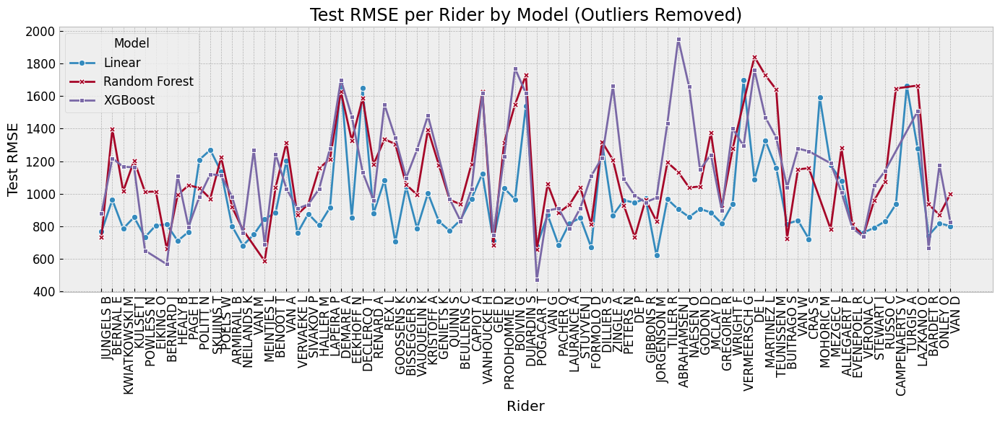
  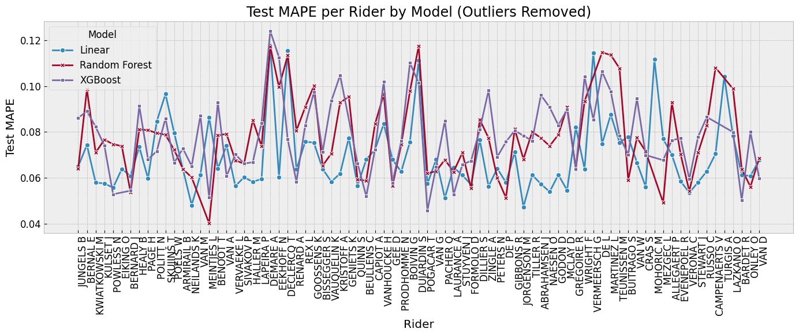

## Future Work

- Try different algorithms for covering a ride with segments. For example covering with shortest or longest segments.
- In addition to time prediction, the power estimation of a rider is important for riders that don’t upload their power data.
- From the PCS database we know how a race ends (solo breakaway, sprint of a group). The prediction of this can be also interesting.
- Bundle up all of these features and use tools like streamlit.io to create an interactive app.

## 📦 Installation

**Requirements:**

- Python 3.12+
- pip

**Steps:**

```bash
# Clone the repository
git clone https://github.com/heineborell/grand_tours.git

# Navigate to the project directory
cd grand_tours

# (Optional) Create and activate a virtual environment
python -m venv venv
source venv/bin/activate  # or venv\Scripts\activate on Windows

# Install dependencies
pip install -e .

## Run the script below from the project root to download database files and set your paths correctly
python scripts/prepare_dataset.py
```

## How to Run Model-1

1. To how the datasets were generated, you can consult the files `data_compiler.py` and `dataset_generator.py` in `notebooks/model_1`. The first of these files contains a function that assembles data frames of grand tour times with aggregated workout data. It relies heavily on the funtion `load data` found in `src/data/data_loader.py` which extracts data from the databases downloaded using the `prepare_dataset.py` script. The second file calls the function in `data_compiler.py` function to generate a 2020-2023 data frame and 2024 data frame, splits the 2020-2023 data into train and test sets, and then saves all four frames in the nearby `data` directory.

2. There are three numbered jupyter notebooks in the directory. You may go through these in order to evaluate the work there. There is an optional fourth unlabled notebook demonstrating a quick grid search for random forest.

## How to Run the Model-2

1. First, run the `segment_param_search.py` script for a given tour and year. This script performs a grid search to find the best models for each rider. The search will be conducted for all selected riders and may take 4–5 hours due to the grid search process. Once complete, a configuration file will be created at `grand_tour/config/config_{tour}_training-{year}_individual.json`.

```bash
python scripts/segment_param_search.py
```

2. Then, for k-fold training, run `segment_kfold_train.py`. This script will compute RMSE and MAPE for each rider and model, and save the results to `notebooks/model_results/segment_cv_results_{tour}_{year}.csv`.

```bash
python scripts/segment_kfold_train.py
```

3. For the test results run `segment_train_test.py`. This script will compute RMSE and MAPE for each rider and model, and save the results to `notebooks/model_results/segment_test_results_{tour}_{year}.csv`.

```bash
python scripts/segment_train_test.py
```

4. Finally, use the Jupyter notebooks `plot_cv_rmse.ipynb` and `plot_segment_test.ipynb` to visualize the results using the generated CSV files.

## Appendix:

### The general structure of database

Here we discuss the structure of the database, starting with the relational
table outlined below.

<!-- 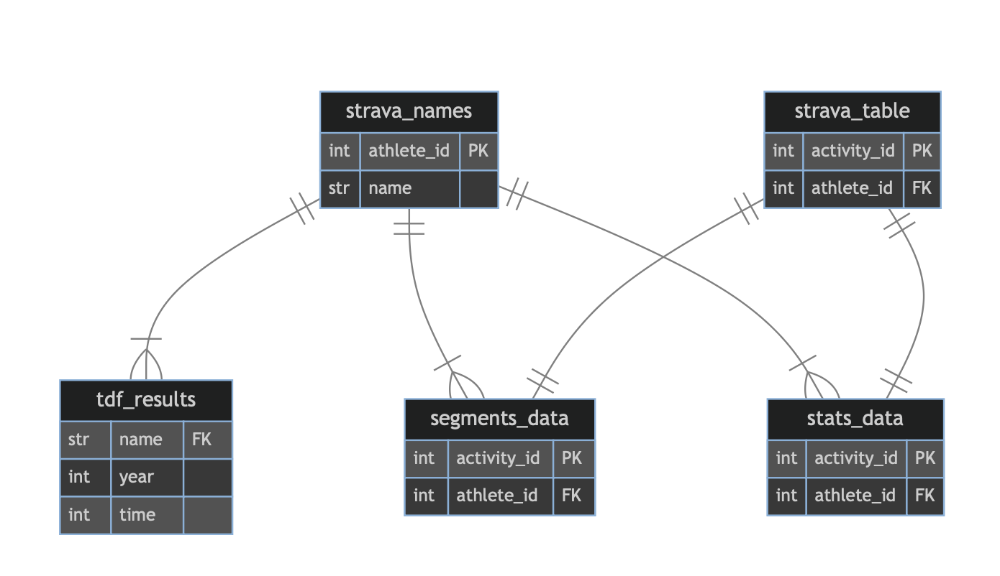 -->


### The tour results dataset

The primary tables in our database are `tdf_results`, `giro_results` and
`vuelta_results`, which contain the historical data of the tours scraped from
[ProCyclingStats](https://www.procyclingstats.com), as an [example](https://www.procyclingstats.com/race/tour-de-france/2024/stage-20). These tables do not have primary keys (i.e., unique values) because their structure involves repeated entries for each rider across different stages and years, as shown below:

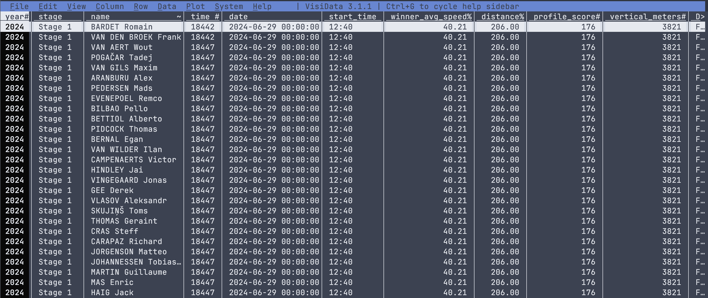

<div style="display: flex; align-items: center;"> 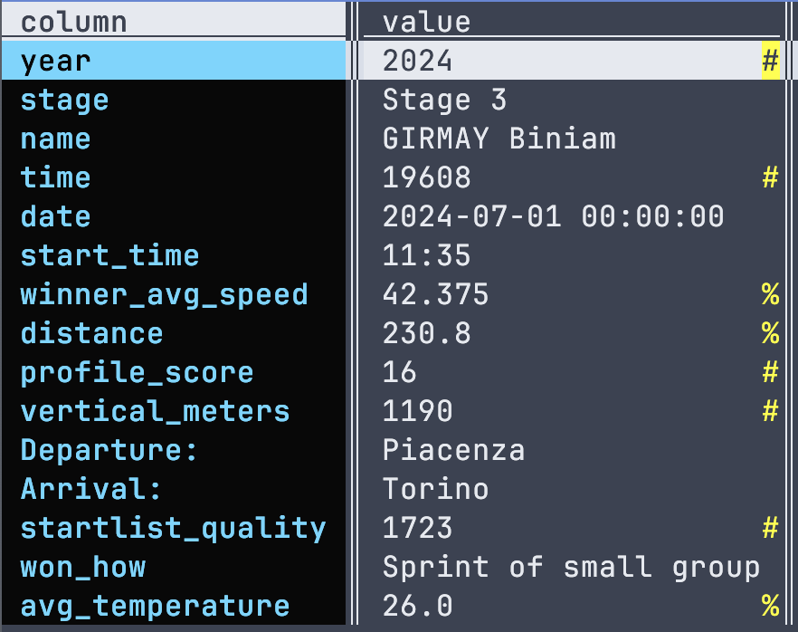 <p>Each row includes the rider's name, the time for a
    specific stage, and the stage properties, which repeat across different
    stages and years. Below the table, we have a summary of the columns using a single rider as an example. The columns in these tables are largely self-explanatory, with the possible exceptions of <code>profile_score</code> and <code>starlist_quality</code>.
    These terms have specific definitions, which can be found in the original
    source links. Unless Strava data is included, it is relatively
    straightforward to extract insights using SQL queries, provided the
    questions are well-defined. </p> </div>

### Strava datasets

<div style="display: flex; align-items: center;">
  <p>Working with Strava datasets requires a more intricate approach for both scraping and structuring. We start with the <code>strava_names</code> table, which contains riders' <code>names</code> and their unique <code>athlete_id</code>. While constructing this table, we assumed that the names in the <code>[tour]_results</code> table are unique (where [tour] = tdf, giro, or vuelta). This assumption is reasonable, as the dataset only includes results from 2010 onward, aligning with Strava's historical data coverage. </p>
  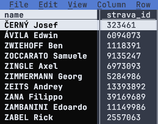
</div>

The table `strava_names` is scraped by first taking the names of the riders from <code>[tour]\_results</code> tables starting from 2010, then each name is searched through Strava search athlete tab. Once we have the result we simply choose the `athlete_id` number with the pro tag on in (see the image below).

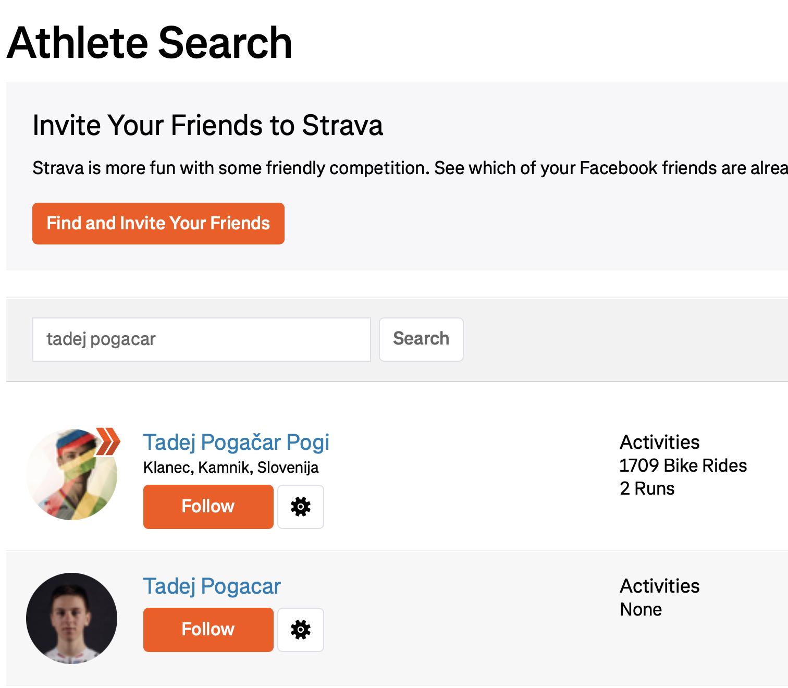

After forming the `strava_names` table we are now in a position to extract the data from riders profile. For that we first visit the riders main page which looks like the following.

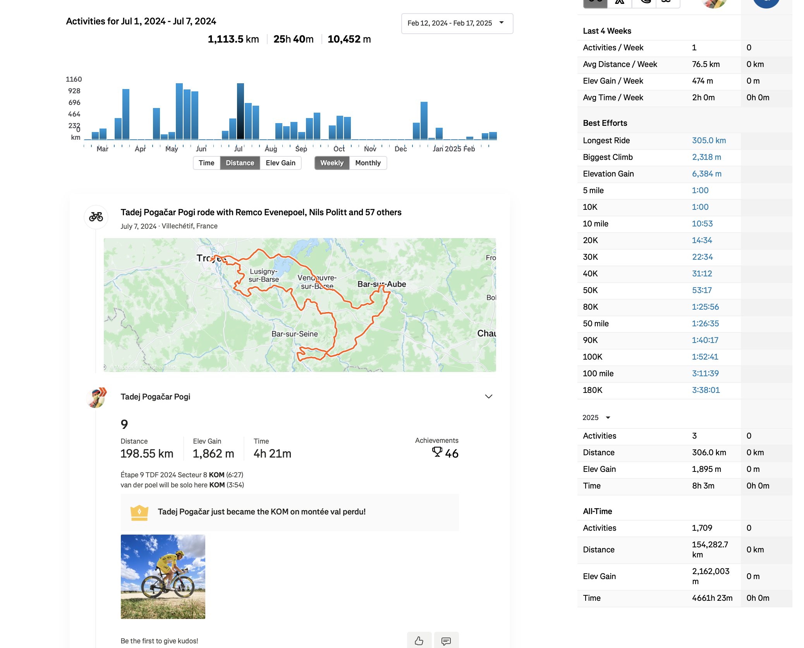

This page lists their activities weekly, so by using the date information from the <code>[tour]\_results</code> tables we can pinpoint each tour-week and scrape the `activity_id` generated throughout the event. Luckily, like the <code>athlete_id</code> each `activity_id` is unique. There is one thing we need to be careful though: although we scraped the activities during the event, by the nature of this scraping process we also extracted some extra activities. This is because, as you can imagine, some riders upload all of their rides including their ride to start-position or rides in their rest days and so on. Therefore, we need a way to clean those activities, which we will discuss after explaining the `segments_data` and `stats-data` tables.

The more data-intensive Strava tables are `segments_data` and `stats_data`. As the name suggests, `segments_data` is scraped from the segment information of a Strava ride. This table can become quite extensive, depending on the number of segments. It includes details such as time, speed, VAM ([velocità ascensionale media](<https://en.wikipedia.org/wiki/VAM_(bicycling)>) or "average ascent speed" in English), power, and heart rate—if the rider has chosen to upload these metrics.

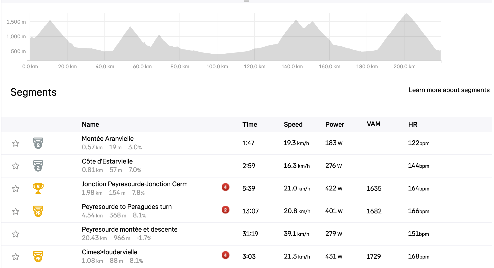

In the `segments_data` table, we chose to keep the `activity_id`, `athlete_id`, `date`, and `distance` fields explicit while bundling the `segments` data into a JSON blob. Since the `activity_id` serves as the primary key, it can efficiently distinguish between rides. A snapshot of the table can be seen below.

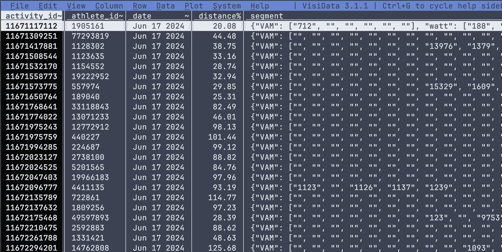

The `stats_data` table contains general data scraped from Strava ride summaries. Since the type of data varies significantly between rides, it also makes sense to store this information as a JSON blob, similar to the `segments_data` table.

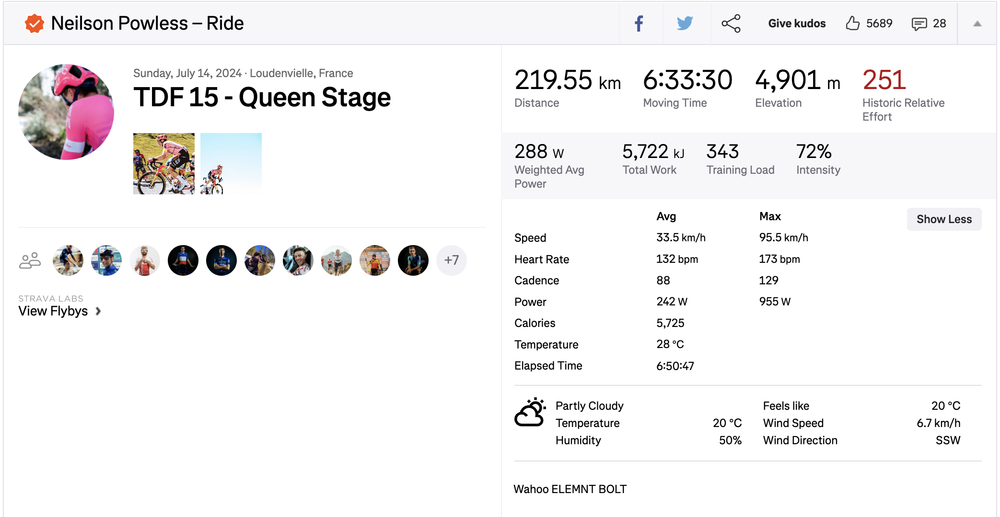

An example of the structure of the `stats_data` table along with detailed column information for the `segments` and `stats` tables is shown below"

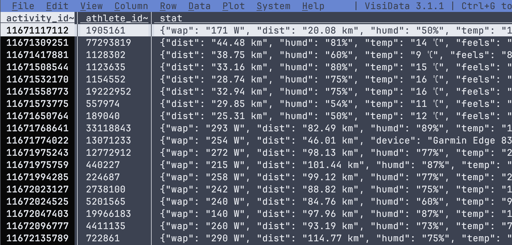

|           Segments columns           |            Stats columns             |
| :----------------------------------: | :----------------------------------: |
| 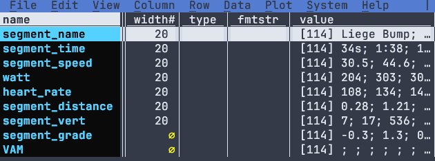 | 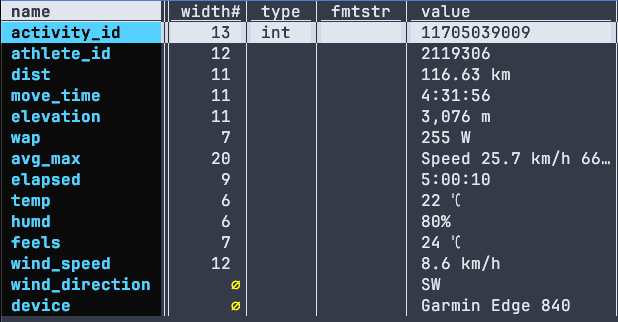 |

Finally, `strava_table` is basically merge of `segments_data` and `stats_data` tables and restricting them into race days so that there are no extra activities other than race data. We also choose the activities that are "close" to official distance. Below is the SQL query for the table construction using the data from `tdf_results`, `segments_data` and `stats_data`.

```sql
SELECT  t3.activity_id,
        t3.athlete_id,
        t3.tour_year,
	t3.strava_distance,
	t1.distance as official_distance,
        t3.DATE,
	t3.segment,
	t3.stat
        FROM(
SELECT
	t2.activity_id,
	t2.athlete_id,
	CAST(t2.`date` AS text) AS DATE,
	t2.tour_year,
	t2.distance as strava_distance,
	t2.segment,
	l.stat
FROM
	segments_data AS t2
LEFT JOIN stats_data AS l
	ON l.activity_id = t2.activity_id) as t3
INNER JOIN (SELECT
	DISTINCT(substr("--JanFebMarAprMayJunJulAugSepOctNovDec",
    strftime("%m", DATE) * 3, 3)||' '||CAST(strftime('%d', DATE) AS INTEGER)||' '||strftime('%Y', DATE)) AS tdf_date,
	stage, distance
FROM
	tdf_results
) AS t1
ON t1.tdf_date  = t3.DATE
WHERE (t1.distance-t1.distance * 0.2 ) < t3.strava_distance
AND t3.strava_distance < (t1.distance * 0.2 + t1.distance);

```
